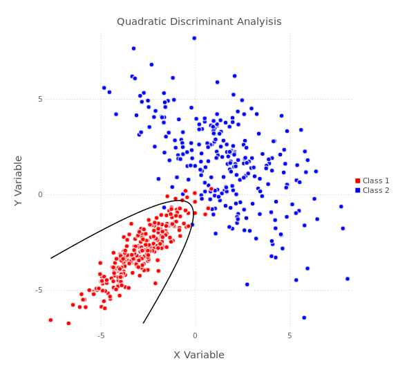
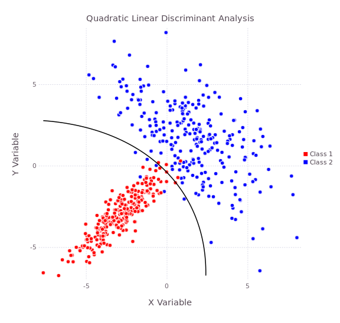

# Discriminant Analysis

Linear and Quadratic Discriminant Analysis in the context of classification 
arise as simple probabilistic classifiers. Discriminant Analysis works under the
assumption that each class follows a Gaussian distribution. That is, for each
class $k$, the probability distribution can be modelled by the function $f$:

$$
f_k(x) = \frac{\exp\left(\frac{-1}{2}(\mathbf{x}-\mathbf{\mu_k})^{\intercal}\Sigma_k^{-1}(\mathbf{x}-\mathbf{\mu_k})\right)}{(2\pi)^{p/2}\left|\Sigma_k\right|^{1/2}}
$$

Let $\pi_k$ represent the prior class membership probabilities. Application of Baye's Theorem yields the following :

$$
P(K = k | X = \mathbf{x}) = \frac{f_k(\mathbf{x})\pi_k}{\sum_i f_i(\mathbf{x})\pi_i}
$$

Noting that probabilities are non-zero and the natural logarithm is
monotonically increasing, the following rule can be used for classification:

$$
\argmax_k \frac{f_k(\mathbf{x})\pi_k}{\sum_i f_i(\mathbf{x})\pi_i}
= \argmax_k \log\left(f_k(\mathbf{x})\right) + \log(\pi_k)
$$
Application of the natural logarithm helps to simplify the classification rule 
when working with a Gaussian distribution. The resulting set of functions
$\delta_k$ are known as **discriminant functions**. In the context of LDA
and QDA, discriminant functions are of the form:

$$
\delta_k(\mathbf{x}) = log(f_k(\mathbf{x})) + log(\pi_k)
$$

## Linear Discriminant Analysis (LDA)

Linear Discriminant Analysis works under the simplifying assumption that
$\Sigma_k = \Sigma$ for each class $k$. In other words, the classes
share a common within-class covariance matrix. Since
$\mathbf{x}^\intercal \Sigma \mathbf{x}$ term is constant across classes, 
this simplifies the discriminant function to a linear classifier:

$$
\delta_k(x) = 
    - \mathbf{\mu_k}^{\intercal}\Sigma^{-1}\mathbf{x} 
    + \frac{1}{2}\mathbf{\mu_k}\Sigma^{-1}\mathbf{\mu_k}
    + \log(\pi_k)
$$

The following plot shows the linear classification boundaries that result when a
sample data set of two bi-variate Gaussian variables is modelled using linear
discriminant analysis:

## Quadratic Discriminant Analysis (QDA)

Quadratic Discriminant Analysis does not make the simplifying assumption that
each class shares the same covariance matrix. This results in a quadratic
classifier in $\mathbf{x}$

$$
\delta_k(\mathbf{x}) = 
    -\frac{1}{2}(\mathbf{x}-\mathbf{\mu_k})^{\intercal}\Sigma_k^{-1}(\mathbf{x}-\mathbf{\mu_k})
    -\frac{1}{2}\log\left(\left|\Sigma_k\right|\right) 
    + \log(\pi_k)
$$

The following plot shows the quadratic classification boundaries that result 
when a sample data set of two bi-variate Gaussian variables is modelled using 
quadratic discriminant analysis:

Note that quadratic discriminant analysis does not necessarily perform better
than linear discriminant analysis. 

## Canonical Discriminant Analysis (CDA)

Canonical discriminant analysis expands upon linear discriminant analysis by
noting that the class centroids lie in a $c-1$ dimensional subspace of the
$p$ dimensions of the data where $c$ is the number of classes. 
Defining the between-class covariance matrix:

$$
\Sigma_b = \frac{1}{c} \sum_{k=1}^{c} (\mu_k - \mu)(\mu_k - \mu)^{\intercal}
$$

Canonical discriminant analysis then optimizes the generalized Rayleigh quotient
of the between-class covariance and the within-class covariance to solve for 
the optimal axes to describe class separability:

$$
\argmax_{\mathbf{w}} \frac{\mathbf{w}^{\intercal}\Sigma_b\mathbf{w}}{\mathbf{w}^{\intercal}\Sigma\mathbf{w}}
$$

For two class LDA, the canonical coordinate is perpendicular to the separating
hyperplane produced by the decision boundary. For the LDA model above, the
dimensionality is reduced from 2 to 1. The following image shows the resulting
distribution of points relative to the canonical coordinate:

## Using LDA to do QDA

A quadratic boundary using LDA can be generated by squaring each variable and by
producing all the interaction terms. For two variables $x$ and $y$,
this is simply:

$$
x + y + x^2 + y^2 + xy
$$

The transformed variables may be used as inputs for the LDA model. This results
in a quadratic decision boundary:

Note that this boundary does not correspond to the same boundary produced by
QDA.

## Calculation Method

As a result of floating point arithmetic, full inversion of a matrix may
introduce numerical error. Even inversion of a small matrix may produce
relatively large error (see [Hilbert matrices](https://en.wikipedia.org/wiki/Hilbert_matrix)), so alternative methods are 
used to ensure numerical stability.

For each class covariance matrix in QDA (or the overall covariance matrix in
LDA), a whitening matrix $W_k$ is computed such that:

$$
\mathbb{V}(X_k W_k) 
    = W_k^{\intercal} \operatorname{V}(X_k) W_k
    = W_k^{\intercal} \mathbf{\Sigma}_k W_k
    = I \quad \implies \quad W = \mathbf{\Sigma}^{-1/2}
$$

This is accomplished using an QR or singular value decomposition of the data 
matrix where possible. When the covariance matrix must be calculated directly,
the Cholesky decomposition is used to whiten the data instead.

Once the whitening matrix has been computed, we can then use the transformation:

$$
\mathbf{z}_k = W_k^{\intercal}\mathbf{x}
\quad \implies \quad Z_k = X W_k
$$

Since we are now working in the transformed space, the determinant goes to zero
and the inverse is simply the identity matrix. This results in the simplified
discriminant function:

$$
\delta_k(\mathbf{z_k}) =  
-\frac{1}{2}(\mathbf{z_k}-\mathbf{\mu_k})^{\intercal}(\mathbf{z_k}-\mathbf{\mu_k})
+ \log(\pi_k)
$$

## References

  * Friedman J. 1989. *Regularized discriminant analysis.* Journal of the American statistical association 84.405; p. 165-175.
  * Hastie T, Tibshirani R, Friedman J, Franklin J. 2005. *The elements of statistical learning: data mining, inference and prediction*. The Mathematical Intelligencer, 27(2); p. 83-85.
